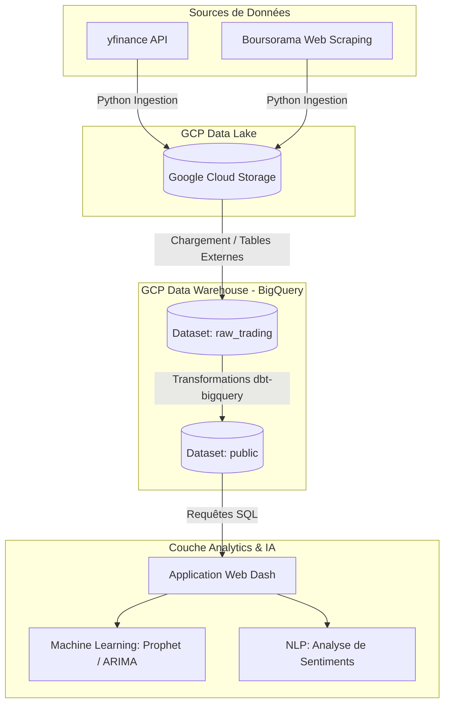

# IntelliTrade - Modern Trading & NLP Stack on GCP (CAC 40)

IntelliTrade est une plateforme moderne de traitement de données boursières, d'analyse prédictive et d'intelligence NLP pour l'indice CAC 40. Le projet implémente une architecture de **Data Lake / Data Warehouse serverless** sur **Google Cloud Platform (GCP)** utilisant **Google Cloud Storage (GCS)**, **Google BigQuery** et **dbt-bigquery**.

---

## 🏗️ Architecture Data Lake / Data Warehouse sur GCP

Le projet met en œuvre un pipeline de données ELT moderne et robuste, conçu pour la scalabilité et l'analyse avancée :



### Description des Couches de l'Architecture :

1. **Couche Ingestion & Data Lake (GCS)** :
   - Les scripts d'ingestion Python interrogent l'API `yfinance` pour extraire l'historique et scrappent Boursorama pour le temps réel.
   - Les données brutes extraites sont stockées au format brut (CSV/JSON/Excel) dans un bucket **Google Cloud Storage** (faisant office de **Data Lake**) pour assurer la traçabilité des données d'origine.
   - *Scripts associés* : [extract_history.py](file:///Users/filalidhia/Projets/trading_project-main/src/ingestion/extract_history.py) et [extract_realtime.py](file:///Users/filalidhia/Projets/trading_project-main/src/ingestion/extract_realtime.py).

2. **Couche Data Warehouse (Google BigQuery)** :
   - Les fichiers du Data Lake sont chargés ou montés en tables externes dans le dataset **`raw_trading`** de BigQuery (les données y restent brutes).
   - Les transformations analytiques et le nettoyage de données sont exécutés au cœur de BigQuery à l'aide de **dbt-bigquery**.
   - dbt matérialise les tables prêtes pour l'analyse et enrichies d'indicateurs techniques (Moyennes Mobiles SMA 5/20, Rendements Quotidiens) dans le dataset final **`public`** (table `mart_financial_features`).
   - *Modèles d'analyse* : [stg_data_trading.sql](file:///Users/filalidhia/Projets/trading_project-main/dbt_project/models/staging/stg_data_trading.sql) et [mart_financial_features.sql](file:///Users/filalidhia/Projets/trading_project-main/dbt_project/models/marts/mart_financial_features.sql).

3. **Couche Restitution & IA (Dash, ML & NLP)** :
   - L'application **Dash (Plotly)** interroge de manière performante le dataset d'analyse BigQuery.
   - Les modules prédictifs entraînent en temps réel des modèles de séries temporelles (**Prophet**, **ARIMA**, **Régression Linéaire**) pour prédire l'évolution des cours.
   - Le moteur **NLP** extrait les flux d'actualités et classifie en temps réel le sentiment du marché pour chaque entreprise du CAC 40.
   - Les deux signaux (ML technique et NLP actualités) convergent dans le module de trading quantitatif pour recommander une action (Achat, Vente, Conservation).
   - *Application associée* : [app.py](file:///Users/filalidhia/Projets/trading_project-main/src/dashboard/app.py).

---

## ☁️ Déploiement Cloud Target (Serverless)

Pour déployer cette architecture en production sur GCP :
- **Ingestion & Ingestion Temps Réel** : Conteneurisés sous Docker et déployés en tant que **Cloud Run Jobs**, planifiés toutes les heures par **Cloud Scheduler**.
- **Transformation (dbt)** : Orchestré à l'aide de **dbt Cloud** ou exécuté via un conteneur d'orchestration dans **Google Cloud Composer** (Airflow).
- **Dashboard** : Hébergé sur **Cloud Run** avec passage à l'échelle automatique (auto-scaling) selon le trafic.

---

## 🚀 Guide de Démarrage Rapide

### 1. Prérequis
- Un projet GCP avec l'API BigQuery activée.
- Un compte de service (*Service Account*) GCP doté des rôles **BigQuery Admin** (ou au moins *BigQuery Data Editor* et *BigQuery User*).
- Télécharger la clé privée au format JSON du compte de service et la renommer en `config/gcp_service_account.json` (ce fichier est listé dans le `.gitignore` et ne sera pas poussé sur GitHub).

### 2. Installation de l'Environnement Local
Créez et activez votre environnement virtuel Python, puis installez les dépendances :
```bash
python3 -m venv .venv
source .venv/bin/activate  # Sur macOS/Linux
pip install -r requirements.txt
```

### 3. Exécution du Pipeline

Toutes les commandes doivent être exécutées depuis la racine du projet avec l'environnement virtuel activé.

#### Étape 1 : Ingestion des données historiques
Exécutez le script d'ingestion historique. Il va créer automatiquement le dataset `raw_trading` et la table `data_trading` dans votre projet BigQuery, puis y injecter les données :
```bash
python src/ingestion/extract_history.py
```

#### Étape 2 : Exécution des transformations dbt
Compilez et matérialisez les vues finales contenant les indicateurs techniques sur BigQuery dans le dataset `public` :
```bash
.venv/bin/dbt run --project-dir dbt_project --profiles-dir dbt_project
```
Pour exécuter les tests de qualité de données dbt :
```bash
.venv/bin/dbt test --project-dir dbt_project --profiles-dir dbt_project
```

#### Étape 3 : Lancement du Dashboard Premium
Lancez le serveur de développement local Dash :
```bash
python src/dashboard/app.py
```
Le tableau de bord est alors accessible sur : **`http://127.0.0.1:8050/`**

---

## 📬 Scraping Temps Réel & Alertes
Le script temps réel scrape Boursorama et pousse les cours en temps réel dans BigQuery. En clôture de séance, il génère le rapport Excel et l'envoie par email :
```bash
python src/ingestion/extract_realtime.py
```
*Note : Assurez-vous d'avoir configuré les paramètres SMTP de votre adresse d'envoi dans `config/mail_config.json`.*

---
*Projet d'architecture data & IA moderne migré sur GCP BigQuery (2026).*
