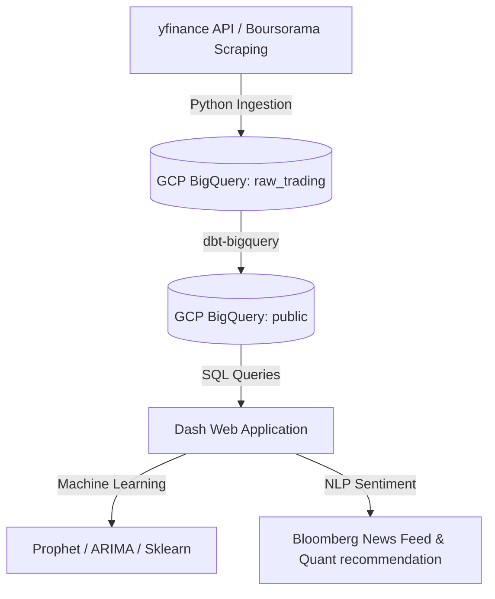

# IntelliTrade - Modern Trading & NLP Stack on GCP (CAC 40)

IntelliTrade est une plateforme moderne de traitement de données boursières, d'analyse prédictive et d'intelligence NLP pour l'indice CAC 40. Le projet a été migré d'une architecture locale vers une architecture moderne serverless sur **Google Cloud Platform (GCP)** utilisant **Google BigQuery** et **dbt-bigquery**.

---

## 🏗️ Stack Technique & Architecture GCP

Le projet s'articule autour d'un pipeline de données moderne et d'un entrepôt de données serverless dans le cloud :



1. **Ingestion Cloud-Ready (`src/ingestion/`)** :
   - `extract_history.py` : Télécharge 2 ans d'historique de cours horaires pour les actions du CAC 40 via l'API `yfinance` et les insère dans BigQuery (`raw_trading.data_trading`).
   - `extract_realtime.py` : Scrape Boursorama en temps réel pendant les heures de marché, écrit un rapport Excel quotidien et l'envoie par email avec des indicateurs de synthèse.
2. **Entrepôt de Données & Transformations (`dbt_project/`)** :
   - **Google BigQuery** : Entrepôt de données analytiques serverless stockant les données brutes et les tables d'analyse.
   - **dbt-bigquery** : Nettoie, dédouble et enrichit les données boursières directement sur BigQuery, matérialisant le modèle `public.mart_financial_features` (calcul des moyennes mobiles SMA 5, SMA 20 et des rendements périodiques).
3. **Dashboard Premium & IA (`src/dashboard/`)** :
   - **Dash (Plotly)** : Interface utilisateur premium avec un thème sombre moderne et un design en verre (*glassmorphism*).
   - **Machine Learning** : Modélisation prédictive en temps réel sur les 30 prochains jours (Prophet, Régression Linéaire, ARIMA).
   - **Sentiment Analysis & NLP** :
     - Agrégation d'actualités financières et classification de sentiment à l'aide d'un modèle d'analyse lexicale optimisé.
     - Affichage de la répartition (Donut Chart) et d'un indicateur global ("FORTEMENT HAUSSIER", etc.).
     - Moteur de recommandation croisant la tendance technique ML et le sentiment NLP pour générer des signaux quantitatifs (Achat Fort, Achat, Vente, Vente Forte, Prudence).

---

## ☁️ Architecture de Déploiement Serverless (Cible)

Pour exécuter ce projet en production de manière 100% serverless sur GCP :
- **Ingestion** : Les scripts Python sont packagés dans des conteneurs Docker et déployés en tant que **Cloud Run Jobs**, déclenchés par **Cloud Scheduler** (par exemple toutes les heures pour le temps réel).
- **Transformations** : Les transformations d'indicateurs financiers sont planifiées via **dbt Cloud** ou exécutées dans un workflow d'orchestration (ex: **Cloud Compose / Airflow** ou **Prefect**).
- **Entrepôt** : **Google BigQuery** stocke l'historique sans besoin de serveurs ni de maintenance.
- **Dashboard** : L'interface Dash est déployée sur **Cloud Run**, offrant une scalabilité automatique et une accessibilité mondiale.

---

## 🚀 Guide de Démarrage Rapide

### 1. Prérequis
- Un projet GCP avec l'API BigQuery activée.
- Un compte de service (*Service Account*) GCP doté des rôles **BigQuery Admin** (ou au moins *BigQuery Data Editor* et *BigQuery User*).
- Télécharger la clé privée au format JSON du compte de service et la renommer en `config/gcp_service_account.json` (ce fichier est listé dans le `.gitignore` et ne sera pas poussé sur GitHub).

### 2. Installation de l'Environnement Local
Créez et activez votre environnement virtuel Python, puis installez les dépendances :
```bash
python3 -m venv .venv
source .venv/bin/activate  # Sur macOS/Linux
pip install -r requirements.txt
```

### 3. Exécution du Pipeline

Toutes les commandes doivent être exécutées depuis la racine du projet avec l'environnement virtuel activé.

#### Étape 1 : Ingestion des données historiques
Exécutez le script d'ingestion historique. Il va créer automatiquement le dataset `raw_trading` et la table `data_trading` dans votre projet BigQuery, puis y injecter les données :
```bash
python src/ingestion/extract_history.py
```

#### Étape 2 : Exécution des transformations dbt
Compilez et matérialisez les vues finales contenant les indicateurs techniques sur BigQuery dans le dataset `public` :
```bash
.venv/bin/dbt run --project-dir dbt_project --profiles-dir dbt_project
```
Pour exécuter les tests de qualité de données dbt :
```bash
.venv/bin/dbt test --project-dir dbt_project --profiles-dir dbt_project
```

#### Étape 3 : Lancement du Dashboard Premium
Lancez le serveur de développement local Dash :
```bash
python src/dashboard/app.py
```
Le tableau de bord est alors accessible sur : **`http://127.0.0.1:8050/`**

---

## 📬 Scraping Temps Réel & Alertes
Le script temps réel scrape Boursorama et pousse les cours en temps réel dans BigQuery. En clôture de séance, il génère le rapport Excel et l'envoie par email :
```bash
python src/ingestion/extract_realtime.py
```
*Note : Assurez-vous d'avoir configuré les paramètres SMTP de votre adresse d'envoi dans `config/mail_config.json`.*

---
*Projet d'architecture data & IA moderne migré sur GCP BigQuery (2026).*
